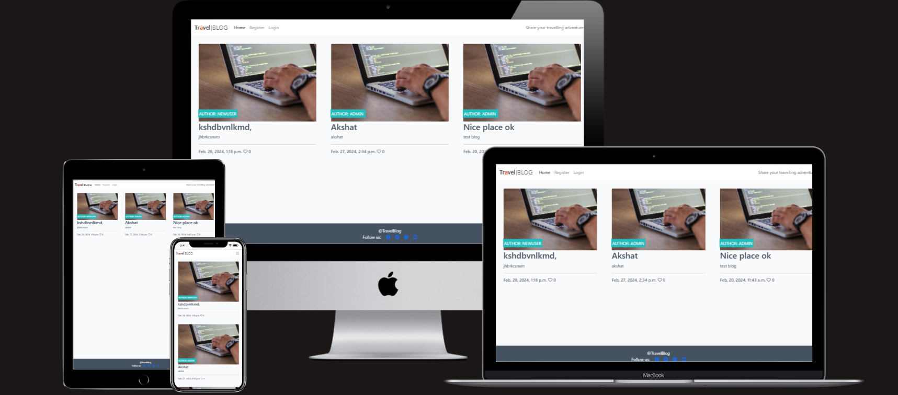

# Travel Blog

The webpage restrain four page, constructed by HTML, CSS and JavaScript.

The website is made for people who love different culture, new places and appreciate share their travelling experiences.
This website allows user to find out other people who has same passion and have conversation by commenting a post, sharing their post with beautiful content and title.

## Features

This webpage has three point of view; site user, user and admin. Site user can can see home, register and login page, they are able to register a account view posted blog, open them and read details. 
Instead user can easily login their page, open a blog, like it, comment it that will show off after approval, post a blog, edit and delete.
Instead Admin has access to django admin page. From where admin has access to approve or reject comments, see user accounts, email, post, modify user posted blog and add image.

# Admin account
***
|name|password|
|---|---|
|admin|Baijid%5|

## Validator Testing

1. HTML:
   No errors were returned when passing through the official W3C validator.

2. CSS:
   No errors were found when passing through the official (Jigsaw) validator.

3. JSHint JavaScript Validator: No errors.

## Deployment

- Deployed on Heroku

The live link can be found here -  <https://studentofcodeinstitute.github.io/expense-tracker-renovated/>

## Solved Bugs

* Crud function; create a post blog function for user.
## Unsolved Bugs
* Remove "Forgot password" text in login page.
* Deployed successfully on heroku but on the app some pages showing up 500 error 

## Credits

The main structure and design has been taken from CodeStar template. Crud function has been created by ideas from previous lessons.

### Content

The main content has been taken from CodeStar template.

# MANUAL TESTING
***
| Feature | Expected Outcome | Testing Performed | Result | Criteria  |
| --- | --- | --- | --- | --- |
| View for all use |
| Home page button | Redirect to home page | Clicked button | Redirect to home page | Pass  |
| Register button | Redirect to register page | Clicked button | Redirect to register page | Pass  |
| login button | Redirect to login page | Clicked button | Redirect to login page | Pass  |
| View blog | On click open blog | Clicked blog | Open the clicked blog | Pass  |
| Like the post | On click like the post | Clicked like button | On click liked the post | Pass  |
| Access to footer link | On click access to the link | Clicked on one of the link | Redirect to one of the link | Pass  |
||
| As a Admin |
| Feature | Expected Outcome | Testing Performed | Result | Criteria  |
| Login to django platform | Redirect to django platform | Logedin with admin credentials | Redirect to django platform | Pass  |
| user information page | Redirect to user information page | Clicked on the user | Redirect to user information page | Pass  |
| Post information page | Redirect to post page and able to post with image detail | Clicked on the post | Redirect to post page and able to post with image detail | Pass  |
| Comment information page | Redirect to Comment page and approve the comment needs approval | Clicked on the comment | Redirect to Comment page and approve the comment needs approval | Pass  |
| Email information page | Redirect to email information page | Clicked on the Email | Redirect to email information page | Pass  |
| Social Accounts information page | Redirect to Social Accounts page and see all accounts | Clicked on the Social Accounts page | Redirect to Social Accounts page and see all accounts | Pass  |
||
| As a Registered user |
| View blog | On click open blog | Clicked blog | Open the clicked blog | Pass  |
| Like the post | On click like the post | Clicked like button | On click liked the post | Pass  |
| login button | Redirect to login page and access to login main page | Clicked button | Redirect to login page and access to login main page | Pass  |
| Access to comment with approval | Able to write comment and submit and see approval needs comment | Clicked button | Able to write comment and submit and see approval needs comment | Pass  |
| Click post button | Able to fillup the form and post new blog | Clicked post | Able to fillup the form and post new blog | Pass  |
| Click edit button | Able to edit only user post | Clicked post | Able to edit only user post | Pass  |
| Click delete button | Able to delete only user post | Clicked delete | Able to delete only user post | Pass  |
| pagination | After six post will automatically move to next page | Added more then six page | After six post will automatically move to next page | Pass  |

# USER STORY
***
|USER STORY|How i achieved|Criteria|
|---|---|---|
|As a Site User/User/Admin I can click on a post so that I can read the full text|Site User/User/Admin can click a post and see details|Pass|
|As a Site User / Admin I can view the number of likes on each post so that I can see which is the most popular or viral|User can see number of likes implemented|Pass|
|As a Site User/Admin I can view a list of posts so that I can select one to read|User can see list of post on home page|Pass|
|As a Admin I can create draft posts so that I can finish writing the content later|Only admin can handle draft posts|Pass|
|As a User I can create, read, update and delete posts so that I can manage my blog content|User can create, edit and delete own posts|Pass|
|As a Site User / Admin I can view comments on an individual post so that I can read the conversation|Site user/user/admin can see all comments|Pass|
|As a Admin I can approve or disapprove comments so that I can filter out objectionable comments|Only admin can approve or disapprove comments|Pass|
|As a Site User / Admin I can like or unlike a post so that I can interact with the content|Site user/user/admin can like or unlike a post|Pass|
|As a User I can leave comments on a post so that I can be involved in the conversation|User has comment body to leave the comment and wait for approval|Pass|
|As a User/ Admin I can login to account so that I can comment, like and view my post list|There is a login button for user and admin to access main page|Pass|
|As a Site User I can register an account so that I can comment, post and like|There is a Register button for site user to register|Pass|
